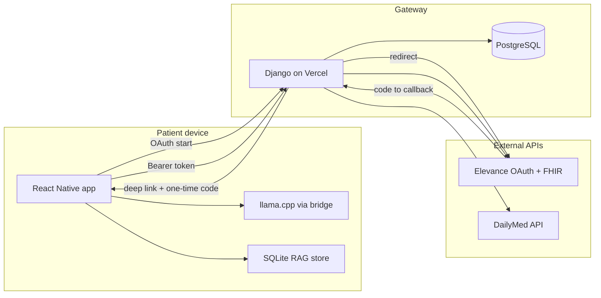

# Medicare Member Retention — Edge-AI POC

This repository is a **proof of concept** for a Medicare member retention tool built around a **zero-trust, on-device** model: clinical reasoning and LLM inference are intended to run **locally** on the patient’s device. The **backend is not a data lake** for PHI—it acts as an **API gateway**, **OAuth broker**, and **HTTP proxy** so the mobile app can reach Elevance FHIR and public drug APIs without embedding secrets in the client where avoidable.

---

## Design goals

| Goal | How it is addressed |
|------|----------------------|
| **Local AI** | React Native app downloads a quantized `.gguf` model and runs inference via **llama.cpp** (through `@react-native-ai/llama`). |
| **No long-lived PHI on the gateway** | Django exchanges OAuth codes and proxies requests; tokens are handed to the app via a **short-lived one-time code**, not pasted into logs by default. |
| **SMART on FHIR + PKCE in serverless** | PKCE `state` + `code_verifier` are stored in **PostgreSQL**, keyed by OAuth `state`—**not cookies**—so flows that bounce through the system browser / Custom Tabs do not break under strict tracking prevention. |
| **Vercel-safe DB usage** | `CONN_MAX_AGE = 0` and a **pooled** `DATABASE_URL` (e.g. PgBouncer / Supabase pooler) to avoid exhausting Postgres connections from ephemeral functions. |
| **CORS** | `django-cors-headers` is configured so **web** testing (Expo web, simulators) does not fail; native apps still send `Authorization` freely. |

---

## Repository layout

```
.
├── api/                          # Vercel serverless entry (WSGI app)
├── gateway/                      # Django app: OAuth session + token exchange models
├── medicare_retention_api/       # Django project (settings, urls, auth_views)
├── mobile/                       # Expo Dev Client app (model download, llama, local RAG scaffold)
├── scripts/
│   └── test_elevance_api.py      # Terminal PKCE + FHIR smoke test
├── manage.py
├── requirements.txt
├── vercel.json
└── apiTest.py                    # Legacy one-off script (superseded by scripts/)
```

---

## Architecture (high level)



1. **Mobile** opens **`GET /authorize/`** on your Django host (or deep-links the user through the browser to that URL).
2. Django stores **PKCE** in Postgres (`PkceSession`, keyed by `state`) and redirects to Elevance’s authorize URL with `aud` = FHIR base URL and SMART scopes.
3. Elevance redirects to **`/callback/`** with `code` + `state`. Django loads the PKCE row, exchanges the code for tokens, encrypts the token payload, stores a **one-time exchange code**, and redirects to **`APP_HANDOFF_URL_BASE?code=...`** (recommended) or falls back to **`APP_DEEPLINK_CALLBACK_BASE?code=...`**.
4. The app **`POST /api/auth/exchange/`** with `{ "code": "..." }` and receives the token JSON (then keeps tokens in secure device storage—your app’s responsibility).
5. For FHIR, the app calls **`GET /api/fhir/eob/?patient_id=...`** with **`Authorization: Bearer <access_token>`**; Django proxies to Elevance (short timeouts, no background work).

---

## Backend (Django)

### Role

- **OAuth**: SMART Authorization Code + PKCE for Elevance; callback and token handoff.
- **Proxy**: FHIR `ExplanationOfBenefit` and DailyMed `drugnames` (minimal POC surface).
- **Persistence**: Postgres for PKCE sessions and one-time token exchange records only (not a clinical data warehouse).

### Important endpoints

| Path | Purpose |
|------|---------|
| `GET /` | JSON index of main routes |
| `GET /health/` | Liveness |
| `GET /authorize/` | Start OAuth; stores PKCE in DB, redirects to Elevance |
| `GET /callback/` | Elevance redirect; exchanges code; redirects to app with one-time `code` |
| `POST /api/auth/exchange/` | Body: `{"code":"<one-time>"}` → token JSON |
| `GET /api/fhir/patient/?patient_id=...` | Header: `Authorization: Bearer ...` → `Patient/{id}` |
| `GET /api/fhir/coverage/?patient_id=...` | Header: `Authorization: Bearer ...` → `Coverage?patient=` bundle |
| `GET /api/fhir/encounter/?patient_id=...` | Header: `Authorization: Bearer ...` → `Encounter?patient=` bundle |
| `GET /api/fhir/eob/?patient_id=...` | Header: `Authorization: Bearer ...` → proxied FHIR JSON |
| `GET /api/drugs/?name=...` | Proxied DailyMed drug name search (POC) |

### Environment variables

**Elevance / SMART**

- `ELEVANCE_CLIENT_ID`, `ELEVANCE_CLIENT_SECRET` (confidential client)
- `ELEVANCE_REDIRECT_URI` — must match the redirect URI registered with Elevance (points to **`https://<your-host>/callback/`** for production)
- `ELEVANCE_AUTH_URL`, `ELEVANCE_TOKEN_URL`, `ELEVANCE_FHIR_BASE_URL`
- `ELEVANCE_SCOPE` (optional; default includes `launch/patient patient/*.read openid fhirUser`)

**App handoff**

- `APP_HANDOFF_URL_BASE` — **recommended** HTTPS handoff page base, e.g. `https://your-expo-web-host/handoff` (backend redirects here with `?code=...` so desktop browsers work)
- `APP_DEEPLINK_CALLBACK_BASE` — native fallback, e.g. `medicare-retention://oauth/callback` (custom scheme; desktop browsers cannot open this). Used only if `APP_HANDOFF_URL_BASE` is unset.
- `PUBLIC_API_BASE_URL` (optional) — explicit API host used when generating handoff redirect `api_base=...` query param for the web handoff page

**Token encryption at rest (exchange table)**

- `TOKEN_ENCRYPTION_KEY` — Fernet key, e.g.  
  `python -c "from cryptography.fernet import Fernet; print(Fernet.generate_key().decode())"`

**Database**

- `DATABASE_URL` — use a **pooler** connection string in production (Supabase pooler, PgBouncer, etc.)
- `DB_SSL_REQUIRE` — default `1` when using `DATABASE_URL`

**Django**

- `DJANGO_SECRET_KEY`, `DJANGO_DEBUG`, `DJANGO_ALLOWED_HOSTS`, `DJANGO_TIME_ZONE`

**CORS**

- `CORS_ALLOW_ALL_ORIGINS` — default `1` for POC; set `0` and `CORS_ALLOWED_ORIGINS` for production

### Local development

```powershell
cd "c:\Users\brtom\Documents\Elevance API"
python -m venv .venv
.\.venv\Scripts\Activate.ps1
pip install -r requirements.txt
```

**`.env`:** With `python-dotenv` installed, both Django and `scripts/test_elevance_api.py` load a `.env` file from the **project root** (same folder as `manage.py`). Variable names must match the documented `ELEVANCE_*` / `DJANGO_*` keys—creating `.env` alone does nothing until you run `pip install -r requirements.txt` (or `pip install python-dotenv`).

**Postgres on localhost:** If `.env` sets `DATABASE_URL` to Postgres (e.g. for Vercel) but **no Postgres is running on your PC**, `runserver` will fail with *connection refused* on port 5432. For local API work, either:

- Set **`DJANGO_USE_SQLITE=1`** in `.env` (uses `db.sqlite3` in the project folder and ignores `DATABASE_URL` for Django), **or**
- Remove / comment out `DATABASE_URL` locally so Django falls back to SQLite, **or**
- Install and start PostgreSQL locally to match `DATABASE_URL`.

Set env vars (at minimum for OAuth views: Elevance vars + `TOKEN_ENCRYPTION_KEY`; for DB: use `DJANGO_USE_SQLITE=1` locally or a reachable `DATABASE_URL`).

```powershell
python manage.py migrate
python manage.py runserver
```

Open `http://127.0.0.1:8000/` — you should see JSON describing the API. A 404 on `/` before the root route was added meant no route existed; the project now serves **`GET /`** as a small JSON index.

**Phone or another PC on the same LAN:** `runserver` only binds to localhost by default, so **`http://192.168.x.x:8000` will not work** from other devices until you run:

`python manage.py runserver 0.0.0.0:8000`

Allow **Python** through Windows Firewall if prompted. (This is separate from **Expo/Metro on port 8081** — see [mobile/README.md](mobile/README.md).)

### Vercel

- `vercel.json` uses `builds` (`@vercel/python`) + `routes` to `api/index.py` — do not add a `functions` block in the same file (Vercel forbids mixing both).
- **Deploy checklist:** see **[DEPLOY_VERCEL.md](DEPLOY_VERCEL.md)** — env vars, Postgres + `migrate` on build, Elevance redirect URI, and troubleshooting.
- **Template:** [`.env.example`](.env.example) lists variable names (no secrets).
- Keep handlers **fast**: outbound HTTP uses short timeouts; no long-running tasks.

---

## Phase 1: Terminal PKCE test

`scripts/test_elevance_api.py` mirrors the same OAuth parameters as the Django app (scopes, `aud`, PKCE S256) but runs entirely in the terminal for integration testing.

```powershell
$env:ELEVANCE_CLIENT_ID="..."
$env:ELEVANCE_CLIENT_SECRET="..."
$env:ELEVANCE_REDIRECT_URI="https://your-registered-callback"
python .\scripts\test_elevance_api.py
```

See `scripts/README.md` for a shorter quick start.

---

## Mobile app (`mobile/`)

See **[mobile/README.md](mobile/README.md)** for dependency hygiene (avoid `npm audit fix --force`, use `npx expo install`).

- **Expo + Dev Client** so native modules (llama, SQLite) are usable.
- **`ModelManager`**: downloads `.gguf` from an HTTPS URL into app document storage with progress.
- **`LlamaService`**: loads the model via `@react-native-ai/llama` (`languageModel` + `textEmbeddingModel`), exposes completion and embedding helpers used by the RAG scaffold.
- **`LocalVectorStore`**: SQLite persistence for chunk text + embedding vectors; similarity search is implemented in-process in the POC (ready to swap for **sqlite-vss** when the native extension is available in your build).
- **`process_medical_data`**: chunks FHIR-shaped JSON, calls **llama embeddings** (not random hashes), and stores rows for later retrieval.

Install and run (from `mobile/`):

```powershell
cd mobile
npm install
npx expo prebuild   # if you use custom native modules / dev client builds
npx expo start
```

Exact native build steps depend on your machine (Xcode / Android Studio); Dev Client is required for full llama + SQLite extension workflows.

---

## Security notes (POC)

- Treat **`ELEVANCE_CLIENT_SECRET`** and **`TOKEN_ENCRYPTION_KEY`** as secrets; never commit them.
- The one-time exchange code is **single-use** and short-lived; still protect your API host with HTTPS and rate limits in production.
- FHIR access tokens are **highly sensitive**; store them only in platform secure storage on device.

---

## Related files

- OAuth + proxies: `medicare_retention_api/auth_views.py`
- URL routing: `medicare_retention_api/urls.py`
- Models: `gateway/models.py`
- Settings (Postgres, CORS, `CONN_MAX_AGE`): `medicare_retention_api/settings.py`
